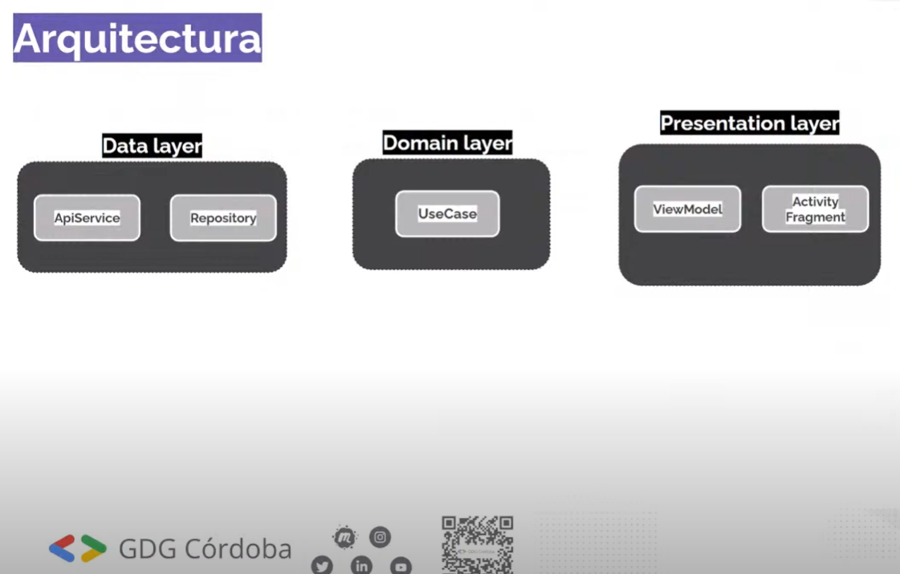
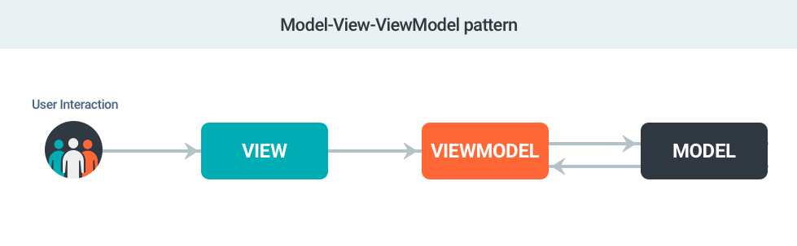

# cornershop-challenge

### architecture mvvm

### DEMO

### Localhost server
- ngrook (https://ngrok.com/)

### Dependencies

- Retrofit 2 (https://square.github.io/retrofit/)
- OkHttp 3 (https://square.github.io/okhttp/)
- Hilt (https://developer.android.com/training/dependency-injection/hilt-android)
- AndroidX (https://mvnrepository.com/artifact/androidx)
- LiveData (https://developer.android.com/topic/libraries/architecture/livedata?hl=es-419)
- ViewModel (https://developer.android.com/topic/libraries/architecture/viewmodel?hl=es)
